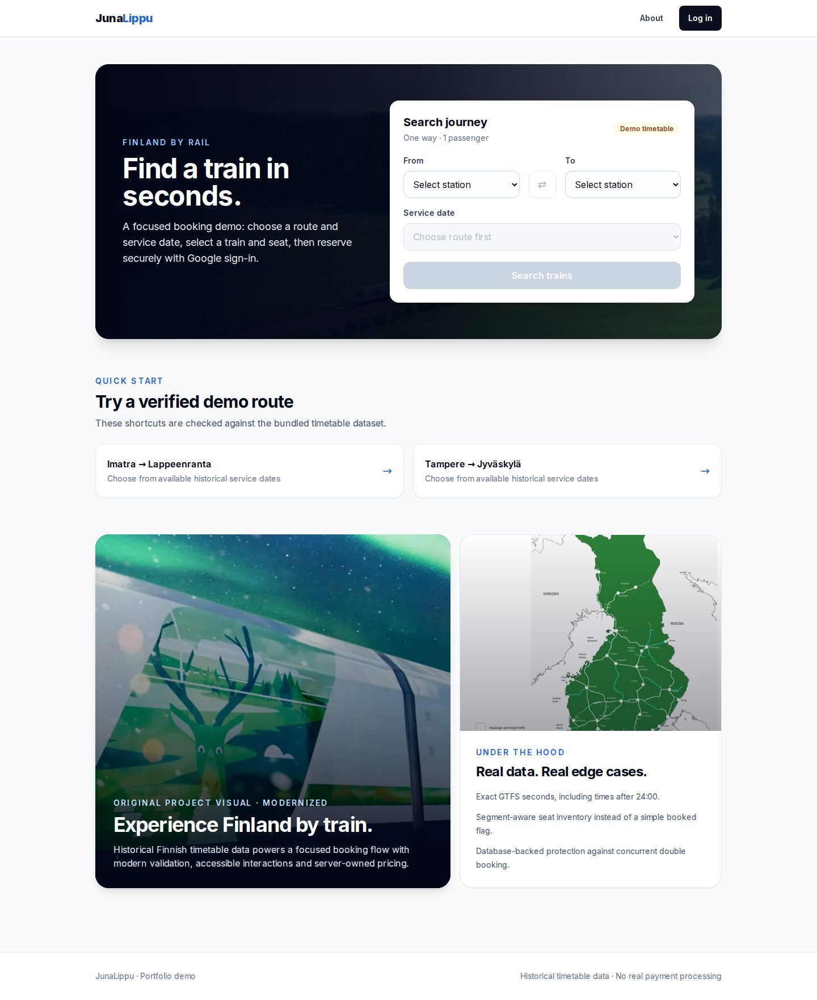

# JunaLippu

[](https://github.com/MykolaDotsenko/JunaLippu/actions/workflows/ci.yml)

**A reliability-focused full-stack Finnish railway booking demo built with Next.js, tRPC, Prisma, NextAuth and Playwright.**

Search historical Finnish train journeys, choose an available seat, authenticate
with Google and create an owner-scoped reservation. The product scope is
intentionally focused — **one-way journeys for one passenger** — while the
engineering goes deeper: segment-aware inventory, race-safe booking, exact GTFS
time handling, reproducible demo data and end-to-end regression coverage.

<p align="center">
  
</p>

> **Portfolio demo:** historical timetable data only. No real payments are processed.

## Why this project is interesting

- **Segment-aware inventory:** a seat can be reused later on the same train when
  journey segments do not overlap.
- **Race-safe booking:** the database unique constraint, not a preflight
  availability check, is the final protection against double booking.
- **Real timetable edge cases:** the bundled data contains GTFS-style
  single-digit hours, seconds, repeated station calls, and times after 24:00.
- **Reproducible demo:** migrations, timetable seeding, dataset-contract tests,
  integration tests, production build, and desktop/mobile browser tests are
  automated.

## Stack

- Next.js 15.5 + React 18 + TypeScript
- Tailwind CSS
- tRPC 11 + TanStack Query 5 + Zod
- Prisma ORM 6 + SQLite
- NextAuth 4.24.15 + Google OAuth
- Playwright
- pnpm
- GitHub Actions CI

## Product flow

```text
Search                /
  ↓
Choose train          /trains
  ↓
Choose class + seat   /seats
  ↓
Review booking        /review
  ↓
Google sign-in (if needed)
  ↓
Reservation confirmed /confirmation
  ↓
Past reservations     /bookings
```

Legacy PascalCase booking URLs permanently redirect to the current routes so
older shared links still resolve.

The home page also exposes quick-start routes that are checked against the
bundled timetable by automated dataset-contract tests.

## Reliability model

The browser is never the source of truth for booking-critical data.

The server:

- resolves the selected trip and route segment;
- validates departure/arrival direction;
- parses GTFS timetable values as exact seconds, including hours after 24:00;
- loads the service date, train, seat, and class from the database;
- calculates the fare from server-owned timetable data;
- re-checks seat availability on review and reservation;
- creates reservations only for the authenticated user;
- reloads confirmations from the authenticated reservation record;
- scopes reservation history and individual reservation reads to their owner.

Money is persisted as integer cents.

### Segment-aware seat inventory

Seat occupancy is represented by `ReservationSegment` rows.

A database unique constraint on:

```text
trip_id + seat_id + stop_sequence
```

prevents overlapping reservations, including concurrent requests. The same
physical seat can still be reused on a later non-overlapping segment.

The availability query improves UX, but the database constraint is the
correctness boundary. A racing unique violation is translated into a booking
conflict, and integration tests prove that exactly one of two concurrent
requests survives.

### Repeated station calls

A trip can visit the same station more than once. Search and booking therefore
pair the earliest departure that has a later arrival by `stop_sequence`
instead of assuming one call per station.

## Timetable data

The railway CSV files in `prisma/` are historical demo data. `Trip` stores an
explicit `service_date`; application logic does not infer dates from IDs.

GTFS time is handled numerically rather than lexicographically. This matters
because the bundled data contains values such as:

```text
5:04:00
10:00:00
24:30:00
31:00:00
10:47:39
```

Validation, sorting, duration, and pricing share the same seconds-based time
primitive.

## Architecture

```text
Next.js Pages UI
   |
   v
tRPC client
   |
   v
Zod-validated procedures
   |
   v
Booking/search domain invariants
   |
   v
Prisma ORM
   |
   v
SQLite
```

The architecture intentionally stays small. Domain rules live beside the tRPC
procedures and pure timetable logic lives in `src/server/api/lib/journey.ts`.
There are no repository/facade/service layers that would only proxy Prisma.

## Quick start

### Requirements

- Node.js 22
- pnpm 9+

### Install and load the demo

```bash
pnpm install --frozen-lockfile
cp .env.example .env
pnpm setup
pnpm dev
```

`pnpm setup` runs migrations and loads the bundled timetable through Prisma.
It does not require a system `sqlite3` executable.

The seed is intentionally conservative:

- an empty railway database is populated;
- an already-complete demo dataset is left unchanged;
- a partial or unrelated railway dataset is refused rather than overwritten.

Open http://localhost:3000.

### Authentication

Google OAuth credentials are optional for local exploration. When they are
missing, the provider is not registered and sign-in controls are disabled.

Production configuration fails fast when authentication secrets are missing.

Expected variables:

```text
DATABASE_URL
NEXTAUTH_URL
NEXTAUTH_SECRET
GOOGLE_CLIENT_ID
GOOGLE_CLIENT_SECRET
```

`NEXT_PUBLIC_SITE_URL` is optional and enables canonical/Open Graph URLs.

## Database workflow

The schema is owned by `prisma/migrations`.

For normal development:

```bash
pnpm exec prisma migrate dev --name what_changed
pnpm db:seed
```

For deployment:

```bash
pnpm db:migrate
```

Do not use `prisma db push` as the normal schema workflow.

### Existing pre-migration databases

Before marking the baseline as applied, first verify that the existing database
matches `prisma/schema.prisma`:

```bash
pnpm exec prisma migrate diff \
  --from-schema-datasource prisma/schema.prisma \
  --to-schema-datamodel prisma/schema.prisma \
  --exit-code
```

Only when no drift is reported:

```bash
pnpm exec prisma migrate resolve --applied 0_init
pnpm db:migrate
```

See `prisma/README.txt` for dataset details.

## Tests

### Fast checks

```bash
pnpm typecheck
pnpm format:check
pnpm lint
pnpm test
```

`pnpm test` includes both pure domain tests and contracts against the actual
CSV dataset. These contracts ensure, among other things, that every quick-start
route really has a bookable service date.

### Database and API integration

```bash
pnpm test:db
pnpm test:integration
```

These commands **do not use the database from your `.env`**. Each command
creates a unique temporary SQLite database, migrates it, runs the suite, and
deletes it afterwards. Destructive test helpers refuse to run without that
isolation marker.

The suites cover:

- overlapping/non-overlapping seat segments;
- concurrent booking of the same seat;
- reservation ownership;
- pagination;
- unauthenticated access;
- invalid/reversed segments;
- loop services;
- GTFS times after midnight;
- numeric timetable ordering;
- partial-leg pricing.

### Browser E2E

Build the app once, install Chromium if needed, then run:

```bash
pnpm build
pnpm exec playwright install chromium
pnpm test:e2e
```

Browser tests use another temporary database and exercise both Desktop Chrome
and a Pixel 7 viewport. They cover the booking flow, URL restoration, keyboard
radio navigation, quick-start routes, auth recovery, legacy redirects,
404/500 recovery, API-error states, and baseline security headers.

### One-command non-browser validation

```bash
pnpm check
```

## CI and security

Pull requests and pushes to `main` verify:

```text
frozen dependency install
Prisma validate/generate
migration deploy + schema drift check
real demo-data seed
TypeScript
Prettier
ESLint
unit + dataset-contract tests
database invariant tests
booking/search integration tests
production build
desktop + mobile Chromium E2E
```

The workflow uses least-privilege `GITHUB_TOKEN` permissions, immutable action
SHAs, and cancels stale runs for the same ref.

Application responses set a baseline CSP plus anti-framing, MIME-sniffing,
referrer, permissions, and production HSTS headers.

## Accessibility

The UI includes:

- a skip link;
- semantic headings and landmarks;
- explicit loading/error/empty states;
- radio-group semantics with roving tabindex and arrow-key navigation;
- visible focus treatment;
- 44px+ interactive targets;
- reduced-motion handling;
- semantic ordered booking progress.

A dedicated automated WCAG/axe audit would still be appropriate before treating
the application as a commercial service.

## Product boundaries

JunaLippu does **not** collect card details or process real money. The review
screen explicitly identifies the application as a portfolio demo.

A commercial ticketing product would additionally need:

- temporary reservation holds and expiry;
- cancellation/refund workflows;
- transactional payment integration;
- production-grade database infrastructure;
- centralized logs, tracing, alerting, and audit trails;
- broader automated accessibility and cross-browser coverage;
- multi-passenger, return-journey, and localization support.

## Contributing

See [CONTRIBUTING.md](CONTRIBUTING.md).

## License

[MIT](LICENSE).

## Disclaimer

JunaLippu is an educational portfolio project and is not affiliated with VR
Group or any railway operator.
