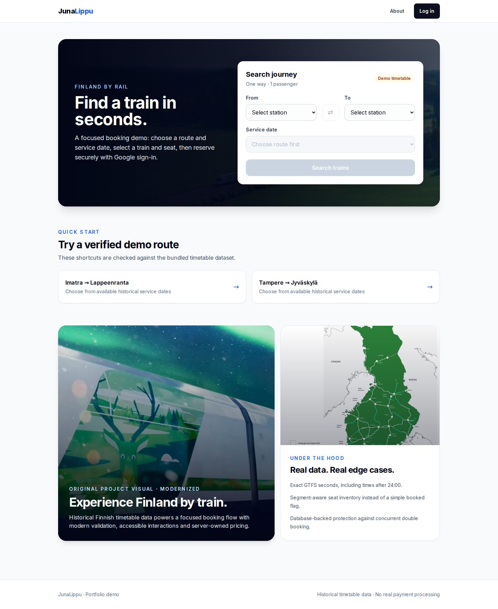

# JunaLippu

[](https://github.com/MykolaDotsenko/JunaLippu/actions/workflows/ci.yml)

**A full-stack Finnish rail-booking demo built around segment-aware inventory, race-safe reservations and exact timetable handling.**

Search historical Finnish train journeys, choose a seat, authenticate with Google and create an owner-scoped reservation.

<p align="center">
  
</p>

> Portfolio demo using historical timetable data. No real payments are processed.

## What makes the project interesting

### A seat is not simply “free” or “taken”

A physical seat can be reused later on the same train when journey segments do not overlap.

Occupancy is represented by `ReservationSegment` rows, and a database unique constraint on:

```text
trip_id + seat_id + stop_sequence
```

protects overlapping reservations.

The availability query improves UX, but the database is the final correctness boundary. Integration tests run two concurrent booking attempts for the same segment and verify that only one succeeds.

### Timetable data has awkward edge cases

The bundled GTFS-style data includes:

```text
5:04:00
10:00:00
24:30:00
31:00:00
10:47:39
```

Times are parsed into seconds rather than compared as strings. Search, duration, ordering and pricing share the same time primitive.

Trips can also visit the same station more than once, so journey search pairs a departure with a later arrival by `stop_sequence` instead of assuming one call per station.

### The browser is not trusted with booking-critical data

The server resolves the trip and segment, calculates fare from server-owned timetable data, re-checks availability and scopes reservation reads/writes to the authenticated owner.

Money is stored as integer cents.

## Stack

- Next.js 15.5 + React 18 + TypeScript
- tRPC 11 + TanStack Query + Zod
- Prisma ORM 6 + SQLite
- NextAuth + Google OAuth
- Tailwind CSS
- Playwright
- pnpm
- GitHub Actions

## Product flow

```text
Search
  ↓
Choose train
  ↓
Choose class + seat
  ↓
Review booking
  ↓
Sign in if needed
  ↓
Reservation confirmed
  ↓
Past reservations
```

The scope stays intentionally narrow: **one-way journeys for one passenger**.

## Architecture

```text
Next.js UI
   ↓
tRPC client
   ↓
Zod-validated procedures
   ↓
booking + timetable rules
   ↓
Prisma
   ↓
SQLite
```

The code deliberately avoids repository/facade layers that would only proxy Prisma. Pure timetable logic lives separately from request handling, while booking invariants stay close to the database operations they protect.

## Reproducible demo data

`pnpm setup` runs migrations and loads the bundled timetable through Prisma.

The seed refuses to overwrite a partial or unrelated railway dataset. An empty database is populated; an already-complete demo database is left intact.

## Tests

Fast checks:

```bash
pnpm typecheck
pnpm format:check
pnpm lint
pnpm test
```

Database/API integration:

```bash
pnpm test:db
pnpm test:integration
```

These suites create isolated temporary SQLite databases rather than using the database from `.env`.

Coverage includes:

- overlapping and non-overlapping seat segments;
- concurrent booking of the same seat;
- reservation ownership;
- invalid/reversed segments;
- repeated-station/loop services;
- GTFS times after midnight;
- numeric timetable ordering;
- partial-leg pricing;
- unauthenticated and API-error paths.

Browser verification:

```bash
pnpm build
pnpm exec playwright install chromium
pnpm test:e2e
```

Desktop and mobile flows cover booking, URL restoration, quick-start routes, auth recovery, legacy redirects and error states.

One-command non-browser gate:

```bash
pnpm check
```

## Run locally

Requirements: Node.js 22 and pnpm 9+.

```bash
pnpm install --frozen-lockfile
cp .env.example .env
pnpm setup
pnpm dev
```

Open `http://localhost:3000`.

Google OAuth is optional for local exploration. When credentials are absent, sign-in controls are disabled rather than exposing a broken provider.

## Product boundaries

JunaLippu does **not** process real payments and is not presented as a production ticketing service.

A commercial version would still need reservation holds/expiry, refunds, payment integration, production database infrastructure, stronger observability, broader accessibility/cross-browser coverage, multi-passenger journeys and localization.

## Contributing

See [CONTRIBUTING.md](CONTRIBUTING.md).

## License

[MIT](LICENSE)

## Disclaimer

JunaLippu is an educational portfolio project and is not affiliated with VR Group or any railway operator.
